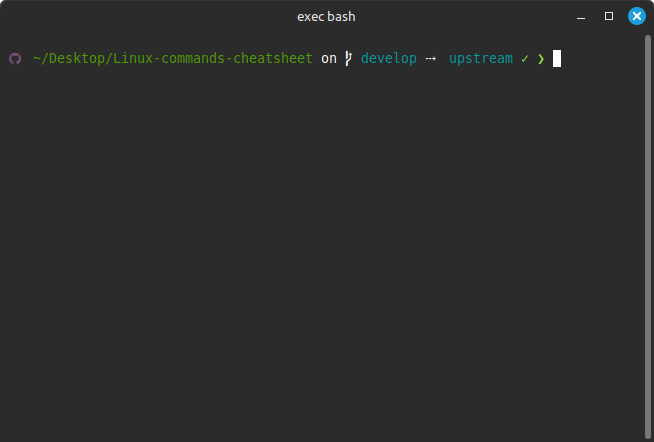
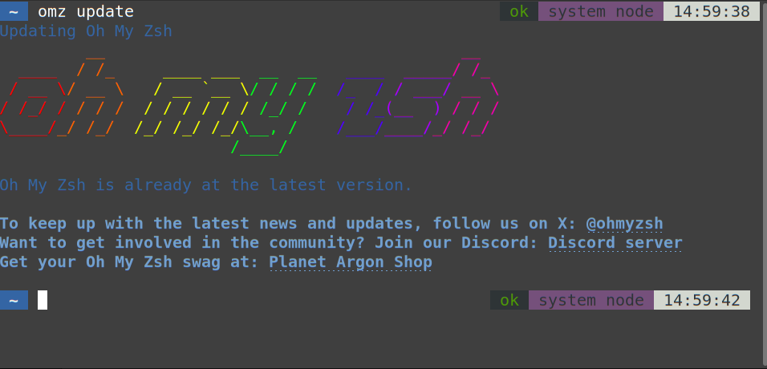

# Linux terminal cheatsheet

## 📌 Sommaire
* [🔧 Commandes](#🔧-commandes)
    * [📁 Navigation / Gestion de dossiers](#📁-navigation--gestion-de-dossiers)
    * [📝 Manipulation de fichiers](#📝-manipulation-de-fichiers)
    * [🔐 Permissions](#🔐-permissions)
    * [⌨️ Raccourcis](#⌨️-raccourcis)
        * [Raccourcis Bash](#raccourcis-pour-bash)
        * [Raccourcis zsh](#raccourcis-zsh)
        * [Raccourcis Nano](#raccourcis-nano)
        * [Raccourcis Vim](#raccourcis-vim)
    * [🗃️ Divers](#🗃️-divers)
* [🆚 Bash vs zsh](#🆚-bash-vs-zsh)
    * [⚖️ Comparaison des fonctionnalités](#⚖️-comparaison-des-fonctionnalités)
    * [📥 Installation](#📥-installation)
* [🪛 Frameworks](#🪛-frameworks)


## 🔧 Commandes

### 📁 Navigation / Gestion de dossiers
|Commande|Description|Exemple|
|--------|-----------|-------|
|`pwd`|Affiche le chemin du répertoire courant|`pwd` : `/home/user/cda`|
|`ls`|Liste les fichiers et dossiers|`ls` : `dossier1 fichier1 ...`|
|`ls -l`|Affiche les fichiers avec des détails supplémentaires|`ls -l` : `taille permission ...`|
|`ls -a`|Affiche les fichiers et dossiers, y compris les fichiers cachés|`ls -a` : `.fichier`|
|`ls -R`|Affiche les fichiers et sous-dossiers récursivement|`ls -R` : `dossier1 fichier1 -> dossier1 -> dossier2 fichier2 ...`|
|`cd ..`| Revenir au répertoire parent| `cd ..`|
|`cd /`|Va à la racine du système|`cd /`|
|`cd ~`|Va dans le dossier personnel de l'utilisateur |`user/home`|
|`cd dossier`| Accède à un répertoire spécifique| `cd /chemin/vers/dossier`|
| `mkdir projet`| Crée un dossier| `mkdir projet`|
| `mkdir -p dossier1/dossier2`  | Crée un dossier avec ses sous-dossiers| `mkdir -p projet/docs`|
| `rmdir dossier`| Supprime un dossier vide| `rmdir dossier_vide`|
| `rm -r dossier`| Supprime un dossier et son contenu | `rm -r projet`|


### 📝 Manipulation de fichiers

| Commande | Description | Exemple |
|--|--|--|
`mv [OPTION(S)] `<ins>`SOURCE`</ins>` `<ins>`DESTINATION`</ins> | Déplace un fichier vers une autre destination. Peut aussi servir à renommer. | `mv ficier.txt fichier.txt`<br>Renomme `ficier.txt` en `fichier.txt`<br><br>`mv fichier.txt dossier/fichier.txt`<br>Déplace `fichier.txt` dans `dossier`
`rm [OPTION(S)] [FICHIER]`|Supprime un fichier.|`rm fichier.txt`<br>Supprime fichier.txt
`cat [OPTION(S)] [FICHIER(S)]` | Montre le contenu d'un ou plusieurs fichiers.  | `cat input.txt - append.txt`<br>Montre le contenu de input.txt, stdin, et append.txt.
`touch `<ins>`FICHIER`</ins> | Créer un fichier ou modifier la date de modification.<br>`-c`: Ne pas créer de fichier. | `touch text.txt`<br>Créé le fichier text.txt, ou s'il n'existe pas, modifie sa date.
`head [OPTION(S)] `<ins>`[FICHIER(S)]`</ins> | Montre le début d'un (ou de) fichier(s).<br>`-q`: Ne pas afficher les en-têtes (plusieurs fichiers)<br>`-c `<ins>`[-]NB_OCTETS`</ins> / `-n `<ins>`[-]NB_LIGNES`</ins><br>Que les premiers octets/lignes. Le `-` montre tout sauf les derniers octets/lignes. | `head README.md test.txt -n 5`<br>Affiche les 5 premières lignes de README.md et test.txt.
`tail [OPTION(S)] `<ins>`[FICHIER(S)]`</ins> | L'inverse de head, part de la fin plutôt que du début. | `head README.md test.txt -n 5`<br>Affiche les 5 dernières lignes de README.md et test.txt.
`tail`, pour suivre des modifications | `-f`: Montre les changements lorsqu'ils arrivent, suit le fichier même à travers les renommages.<br>`--follow=name`: Suit uniquement le fichier du même nom.<br>`--retry`: Réessayer de lire lorsque l'accès est refusé.<br>`-s`: Temps avec retry. | `tail README.md -F`<br>Lit le README dans son entièreté, montre les mises à jour 
<ins>`TEXTE`</ins>` > `<ins>`FICHIER`</ins> | Insère le texte (en dur, d'une commande) au fichier. | `head README.md -n 5 > test.txt`<br>Copie les 5 premières lignes de README.md dans le fichier test.txt.

### 🔐 Permissions

| Commande             | Description                                          | Exemple           |
| -------------------- | ---------------------------------------------------- | ----------------- |
| `sudo`               | Exécuter une commande en tant que super utilisateur. | `sudo apt update` |
| `su - [Utilisateur]` | Changer d'utilisateur.                               | `su - root`       |
| `visudo`             | Modifier le fichier sudoers.                         | `visudo`               |
| `chmod`              | Modifier les permissions d'un utilisateur.           | `chmod 700 [file.txt]` 700 : utilisateur = r, w, x. groupe et autre n'ont pas de permission |
| `ls -l`              | Vérifier les permissions d'un dossier ou fichier.    | `ls -l [file.txt]`     |

### ⌨️ Raccourcis
#### Raccourcis pour Bash

| Navigation | Description                           |
| ---------- | ------------------------------------- |
| CTRL + A   | Aller au début de la ligne            |
| CTRL + E   | Aller à la fin de la ligne            |
| CTRL + B   | Se déplacer d'un caractère en arrière |
| CTRL + F   | Se déplacer d'un caractère en avant   |
| ALT + B    | Se déplacer d'un mot en arrière       |
| ALT + F    | Se déplacer d'un mot en avant         |
| Tab        | Auto-complétion                       |


| Édition  | Description                                                                 |
| -------- | --------------------------------------------------------------------------- |
| CTRL + U | Couper ou effacer depuis la position du curseur, jusqu'au début de la ligne |
| CTRL + L | Couper ou effacer depuis la position du curseur, jusqu'à la fin de la ligne |
| CTRL + W | Couper ou effacer le mot avant le curseur                                   |
| CTRL + Y | Coller le dernier contenu coupé                                             |
| CTRL + L | Vider le terminal                                                           |


| Historique | Description                                     |
| ---------- | ----------------------------------------------- |
| CTRL + R   | Rechercher dans l'historique                    |
| CTRL + G   | Sortir de la recherche dans l'historique        |
| CTRL + P   | Donner la précédente commande dans l'historique |
| CTRL + N   | Aller à la prochaine commande dans l'historique |
| CTRL + C   | Arrêter la commande en cours                    |

#### Raccourcis zsh
**Note :** les raccourcis zsh sont majoritairement similaire à ceux de Bash.
| Raccourcis          | Description                                                   |
| ------------------- | ------------------------------------------------------------- |
| Alt + W             | Effacer de la position du curseur jusqu'au début de la ligne  |
| CTRL + X + CTRL + E | Démarrer l'éditeur texte par défaut                           |
| CTRL + X + CTRL + X | Sélectionner la ligne du début jusqu'à la position du curseur |


#### Raccourcis Nano
| Raccourcis          | Description                                                             |
| ------------------- | ----------------------------------------------------------------------- |
| CTRL + O            | Sauvegarder le fichier                                                  |
| CTRL + X            | Quitter Nano (avec proposition de sauvegarde si fichier non sauvegardé) |
| CTRL + Y            | Remonter d'une page                                                     |
| CTRL + V            | Descendre d'une page                                                    |
| Alt + \             | Aller à une ligne spécifique                                            |
| Alt + ,             | Aller au début de la ligne                                              |
| Alt + .             | Aller à la fin de la ligne                                              |
| CTRL + K            | Couper/Effacer à partir du curseur jusqu'à la fin de la ligne           |
| CTRL + U            | Annuler couper/Restaurer le texte coupé                                 |
| CTRL + 6            | Créer un bloc de texte pour qu'il soit copié ou coupé                   |
| CTRL + 6 & CTRL + K | Couper/Effacer le bloc de texte                                         |
| Alt + 6             | Copier le bloc de texte                                                 |
| CTRL + W            | Rechercher du contenu dans le texte                                     |
| Alt + W             | Rechercher et remplacer du contenu                                      |
| Alt + R             | Répéter la précédente recherche                                         |

#### Raccourcis Vim
**Mode normal** 
| Raccourcis | Desciption                                                                 |
| ---------- | -------------------------------------------------------------------------- |
| i          | Entrer en mode insertion à la position actuelle du curseur                 |
| x          | Effacer le caractère sous le curseur                                       |
| dd         | Effacer la ligne                                                           |
| yy         | Copier la ligne                                                            |
| p          | Coller le contenu qui a été copié ou coupé en dessous de la ligne actuelle |
| u          | Annuler la dernière action                                                 |
| CTRL + R   | Reproduire à nouveau la dernière action                                    |

**Mode commande**
| Raccourcis        | Description                                               |
| ----------------- | --------------------------------------------------------- |
| :w                | Sauvegarder le fichier                                    |
| :q                | Quitter Vim                                               |
| :q!               | Quitter Vim sans sauvegarder                              |
| :wq               | Sauvegarder et quitter Vim                                |
| :s/avant/après/g  | Changer le contenu d'"avant" par celui voulu dans "après" |
| :set nu ou number | Afficher le nombre de lignes                              |

**Mode visuel**
| Raccourcis | Description                                      |
| ---------- | ------------------------------------------------ |
| v          | Entrer en mode visuel pour sélectionner du texte |
| y          | Copier le texte sélectionné                      |
| d          | Effacer la zone de texte sélectionné             |
| p          | Coller le texte copié ou coupé                   |


### 🗃️ Divers

| Commande      | Description                                   | Exemple                               |
| ------------- | --------------------------------------------- | ------------------------------------- |
| `man `<ins>`[COMMANDE]`</ins> | Affiche le manuel d'une commande | `man man`<br>Affiche le manuel de man |
| `alias`       | Création d'alias.                             | `alias grc='gh repo create'`          |
| `grep`        | Rechercher un mot dans un dossier ou fichier. | `grep "hey" file.txt`                 |
| `find`        | Trouver un fichier.                           | `find . -type f -name "*.txt"`        |
| `curl -0 URL` | Télécharger un fichier.                       | `curl -O http://example.com/file.zip` |
| `tar`         | Archivage et compression.                     | `tar -xvf archive.tar`                |

## 🆚 Bash vs zsh

Bash est le shell par défaut sur plusieurs types de distributions Linux, il existe d'autres shells comme zsh, fish, dash etc...

### ⚖️ Comparaison des fonctionnalités

| Fonctionnalité      | Bash                                   | Zsh                               |
| ------------- | --------------------------------------------- | ------------------------------------- |
| Auto-complétion       | Basique                             | Très avancée et personnalisable          |
| Correction automatique       | Non                             |  Oui         |
| Plugins et thèmes       | Non                             |  Oui         |
| Personnalisation       | Limitée                             |  Beaucoup d'options disponibles         |

### 📥 Installation


| Outil  | Debian/Ubuntu (`apt`)| Arch Linux (`pacman`)| macOS (`brew`)| Documentation|
|--------|----------------------|----------------------|---------------|--------------|
| **Bash** | `sudo apt install bash`| `sudo pacman -S bash`| `brew install bash`| [Documentation GNU Bash](https://www.gnu.org/doc/doc.html) |
| **Zsh**  | `sudo apt install zsh`| `sudo pacman -S zsh`| `brew install zsh`| [Documentation Zsh](https://zsh.sourceforge.io/Doc/)                    |

Une fois l'installation faite, utiliser la commande `chsh` pour changer le shell utilisé par défaut. Un menu apparaîtra qui demandera le chemin du shell à utiliser.
Alternativement, utiliser `chsh -s `<ins>`PATH_AU_SHELL`</ins> 

Une fois le shell modifié, se déconnecter et se reconnecter. En ouvrant le shell, le changement devrait être apparent, mais si ce n'est pas évident, écrire `echo $SHELL` pour s'en assurer.

Par exemple, pour zsh:
1. Utiliser `chsh`
2. Dans le prompt, écrire `/bin/zsh`
3. Se déconnecter et se reconnecter

Ceci changera le shell par défaut pour cet utilisateur à zsh.


## 🪛 Frameworks

### Bash-it :
*Bash-it est un framework open source pour configurer le shell Bash, Bash-it apporte plus de fonctionnalités tel que : alias prédéfinis, l'auto-complétion, plugins, thèmes etc.*

#### Installation avec curl
```bash
 sh -c "$(curl -fsSL https://raw.githubusercontent.com/Bash-it/bash-it/master/install.sh)"
```

#### Installation avec git
```bash
 git clone --depth=1 https://github.com/Bash-it/bash-it.git ~/.bash_it
```

```bash
 ~/.bash_it/install.sh
```

#### Quelques alias prédéfinis dans bash-it

Premierement il faut activer les alias que l'on souhaite utiliser, par exemple pour utiliser les alias git, docker et node (npm) :
```bash
bash-it enable alias git
bash-it enable alias docker
bash-it enable alias npm
```

```bash
#Quelques alias bash-it prédéfinis

## Git
gcl='git clone'
ga='git add'
gst='git status'
gcm='git commit -m'
gco='git checkout'
gl='git pull'

## Docker
dki='docker images'
dklog='docker logs'
dkexec='docker exec -it'
dkrun='docker run -it --rm'
dkbuild='docker build'
dkcompose='docker-compose'

## Node
n='npm'
ni='npm install'
nrb='npm run build'
nrd='npm run dev'
nrt='npm run test'
nrs='npm start'

```
#### Activer un thème : 
```bash
bash-it theme set BarbUk
```



[🔗​ Bash-it documentation](https://bash-it.readthedocs.io/en/latest/)


#### 🚀 Oh My Zsh :  [documentation](https://github.com/ohmyzsh/ohmyzsh/wiki)
*Oh My Zsh est un framework open source et communautaire pour gérer la configuration Zsh, qui améliore Zsh avec des thèmes, des plugins et une configuration optimisée, rendant le terminal plus puissant et agréable à utiliser.*

#### Installation avec cURL
```bash
sh -c "$(curl -fsSL https://raw.githubusercontent.com/ohmyzsh/ohmyzsh/master/tools/install.sh)"
```
#### Installation avec Wget
```bash
sh -c "$(wget -O- https://raw.githubusercontent.com/ohmyzsh/ohmyzsh/master/tools/install.sh)"
```

#### Personalisation et Configuration 

*Exemple :* 
```bash
# Modification de thème
ZSH_THEME="robbyrussel"  # Remplace "robbyrussel" par le thème de ton choix par exemple : agnoster
# Ajout des plugins
plugins=(git zsh-autosuggestions zsh-syntax-highlighting)
# Activation de la correction automatique
setopt correct
# Définition des alias utiles
alias ll="ls -lah"
alias gs="git status"
alias ..="cd .."
# Appliquation des modifications après changement
source ~/.zshrc
```
*Aperçu* : 




